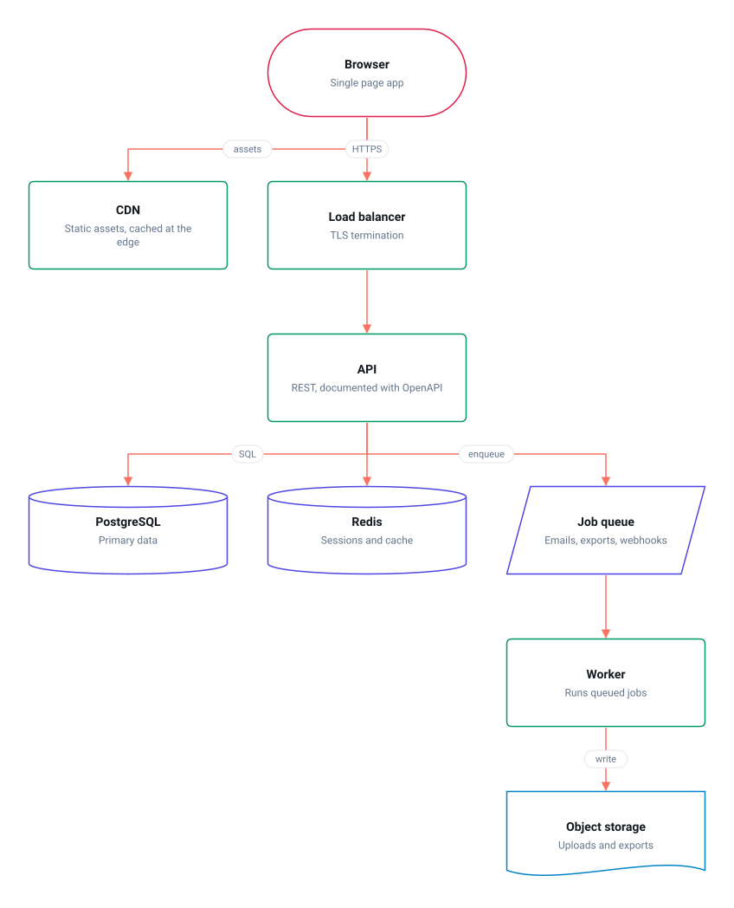

<div align="center">

# isketch

**Sketch it, hand it to your agent.**

A sketchpad for software engineers whose output is exact, agent-ready text. Sketch an
architecture, a database or a flow on a canvas; every sketch is also a readable `.flow` file that
Claude, Copilot or any coding agent reads without guessing, and can edit back.

[Backlog](BACKLOG.md) · [Security](SECURITY.md) · [Agent rules](AGENTS.md)

[](https://github.com/raj-khan/flow/actions/workflows/ci.yml)
[](LICENSE)

https://github.com/user-attachments/assets/cbfbc844-7373-4891-a985-50e2870fe1b5

</div>

## Why not draw.io or Excalidraw?

Both are free and good at drawing. Neither is good at the step that now matters most: getting the
design in your head into a coding agent. A screenshot makes the agent guess at boxes and arrows
from pixels; names get misread, arrows lose their direction, and nothing it writes back can go on
the diagram. A `.drawio` file is an XML blob nobody reviews, so the picture also drifts from the
code until it is wrong.

isketch aims at that gap:

- **Every sketch is exact text.** Ids, kinds, directions and notes, in a line-based `.flow` file
  an agent reads without guessing. Edit the canvas or the text; the other follows.
- **Built for the hand-off.** _Copy for AI_ puts a Markdown brief on the clipboard: every shape by
  what it means for the code, every connection in words, and the source to edit and hand back. An
  [MCP server](#connect-your-agent-mcp) lets an agent list, read, update and draw your diagrams
  itself. Wireframe shapes are next ([Milestone 5](BACKLOG.md#milestone-5-built-for-agents-)).
- **Git native.** Files diff cleanly, a CLI renders SVG with no browser, and pull requests get a
  visual diff, so the design and the code stop drifting apart.
- **Start from real files.** `docker-compose.yml`, OpenAPI and SQL DDL, with re-import that keeps
  your layout.
- **Local first.** No account, no server, works offline, shareable as a link.

What is honestly not there yet: a share link keeps the diagram after the `#`, which browsers never
send to a server, so an AI that fetches the link sees nothing. Links an agent can read need a small
server, planned in [Milestone 7](BACKLOG.md#milestone-7-links-an-agent-can-read). Until then, hand
over the `.flow` file or its text.

> **Status: early.** isketch started as a flow chart exercise called Flow. The canvas, text
> format, importers, CLI and pull request diffs below work today.

## What works today

- **Shapes.** Process, start / end, decision, input / output, database, document, note, table and text,
  each drawn as its own outline. Change a shape's type at any time.
- **Canvas.** Pan, zoom and drag shapes on a Vue Flow canvas. Dragged positions are kept.
- **New diagram and samples.** Start empty, or from a web app architecture or support flow
  sample. Undo brings back whatever was there.
- **Shape palette.** Drag a shape onto the canvas to drop it there, or click it (or press Enter)
  to add it in a clear spot near the middle.
- **Resize.** Select a shape and drag its handles; hold Shift to keep its proportions.
- **Edit in place.** Double-click a shape to rename it, or a connection to add or change its
  label; F2 renames the focused shape. Enter saves, Escape cancels.
- **Select several.** Shift-click, or Shift-drag a box, to select shapes; move them together, or
  delete them with Delete, as one undoable step.
- **Edit and delete.** Every change updates the canvas immediately and rolls back if it fails.
- **Connections.** Drag from one node to another to connect them, as many in and out as you like;
  remove a connection from the control on the edge.
- **Undo and redo** for every change, from the toolbar or `Ctrl+Z` / `Ctrl+Shift+Z`.
- **Deep links.** Each node's details open at `/flow/node/:id`, so a node can be linked to.
- **Keyboard first.** Arrow keys walk the nodes, Enter opens one, `?` lists every shortcut.
- **Automatic layout** for anything you have not placed by hand.
- **Light and dark themes**, following the system until you choose.
- **Saved locally.** Edits are kept in `localStorage` and survive a reload.
- **Edit as text.** Open the text pane beside the canvas and edit the diagram in the
  [`.flow` format](#the-flow-format): typing redraws the canvas, and changes on the canvas rewrite
  the text. Errors are listed by line, and the canvas keeps the last valid diagram meanwhile.
- **Import.** Paste or open a Mermaid flowchart, a `docker-compose.yml`, an OpenAPI spec or
  SQL `CREATE TABLE` statements. Compose services
  become shapes that fit their image (Postgres a database, RabbitMQ a queue), and dependencies
  become connections. An OpenAPI spec becomes a map of its tags and the schemas they use, and SQL an entity diagram
  with keys marked and foreign keys as labelled connections.
  Re-importing updates the diagram and keeps its layout and anything added by
  hand. Anything skipped is listed by line.
- **Copy for AI.** One button copies a Markdown brief for Claude, Copilot or any coding agent: each
  shape with its id and what it means ("a data store", "a branch the code must handle"), each
  connection in words, and the `.flow` source at the end so the agent can change the diagram and
  hand it back. `isketch brief` prints the same from the command line.
- **Copy as Mermaid** from the text pane, for a README.
- **Open and save `.flow` files** (`Ctrl+O`, `Ctrl+S`). In Chrome and Edge, Save writes back to
  the file you opened, so a diagram can live in a repository next to the code it describes.
  Elsewhere Save downloads a copy.
- **Compare versions.** Compare the diagram on screen with the file in your repository, or any
  other version, and see what was added, removed and changed, as a list and as a marked-up
  picture.
- **Share as a link.** The whole diagram travels in the link itself, compressed, so nothing is
  uploaded. Opening one gives the visitor their own copy, and undo brings back theirs.
- **Works offline.** The samples are bundled, so the app makes no network requests.

## The `.flow` format

Every diagram can be written as plain text that reads well and diffs cleanly:

```text
title: Web app architecture

browser = terminal "Browser" -- Single page app
api = process "API" -- REST, documented with OpenAPI
db = database "PostgreSQL"

browser -> api : HTTPS
api -> db : SQL

@layout
browser 276,0
api 276,176
db 276,352
```

- `id = shape "Name" -- description` declares a node. The name and description are optional.
  Shapes are `process`, `terminal`, `decision`, `data`, `database`, `document`, `note`, `table`, `text`.
- `a -> b : label` connects two nodes. The label is optional, and a line may refer to a node
  defined further down.
- `@layout` starts the positions, one `id x,y` per line, with ` WxH` after it for a resized shape. A node with no position is laid out
  automatically, so a hand-written diagram needs no layout block at all.
- `#` starts a comment. A newline inside a description or label is written `\n`.

The full example, [`examples/architecture.flow`](examples/architecture.flow), drawn by
`isketch render` with no browser. CI fails if this picture falls out of date:



One node or edge per line, in a stable order, with the layout kept apart: moving a box changes
one line at the end, and never the lines that say what the system is. `parseFlow` and
`serialiseFlow` in `src/domain/flowText.js` read and write it, reporting every error with its
line number; the text pane, files, share links and the command line all go through them.

## Where it is going

| Milestone               | Highlights                                                          |
| ----------------------- | ------------------------------------------------------------------- |
| 1. A real diagram model | Nodes and edges, general shapes, new diagram, shape palette         |
| 2. The wedge            | `.flow` text format, two way editor, Mermaid, compose, OpenAPI, SQL |
| 3. Git native           | Open and save files, CLI rendering, visual diff, GitHub Action      |
| 4. Editing essentials   | Multi-select, inline text, resize, connectors, clipboard, export    |
| 5. Built for agents     | Copy for AI brief, MCP server, wireframe shapes, actionable notes   |
| 6. Sketch feel          | Hand-drawn style, freehand pen, draw.io XML import and export       |
| 7. Links an agent reads | Hosted diagrams with plain-text URLs, remote MCP                    |

Every ticket, with what "done" means, is in [BACKLOG.md](BACKLOG.md).

## Quick start

### Node

Node 22 or newer.

```bash
npm install
npm run dev
```

Open http://localhost:5173. There is nothing to configure.

### Docker

```bash
docker compose up                   # dev server on http://localhost:5173
docker compose --profile prod up    # production build on http://localhost:8080
```

## Command line

```bash
npm run isketch -- render diagram.flow -o diagram.svg   # draw it, add --dark for the dark theme
npm run isketch -- check docs/*.flow                    # file:line errors, exit 1 if any
npm run isketch -- diff old.flow new.flow -o diff.svg   # what changed, listed and drawn
npm run isketch -- brief diagram.flow                   # a Markdown brief for a coding agent
npm run isketch -- mcp docs                             # an MCP server for the diagrams in docs/
npm run examples                                        # redraw every SVG in examples/
```

It needs only Node: the renderer is the same pure code the app uses, so a docs build or CI can
draw diagrams that match the editor.

## Connect your agent (MCP)

`isketch mcp` is a local [Model Context Protocol](https://modelcontextprotocol.io) server for the
`.flow` files in a folder, so an agent can work with your diagrams itself rather than being handed
a screenshot. It has five tools:

| Tool             | What the agent can do                                                    |
| ---------------- | ------------------------------------------------------------------------ |
| `list_diagrams`  | See every diagram in the folder, with its title and size                 |
| `read_diagram`   | Read one as a brief (shapes by meaning, connections in words) or as text |
| `write_diagram`  | Create or update one; invalid text is refused with line numbers          |
| `render_diagram` | Draw one as SVG                                                          |
| `diff_diagrams`  | Compare a diagram with a proposed version                                |

It needs only Node, and only reads and writes inside the folder you give it. isketch is not on npm
yet, so point at a clone:

```bash
# Claude Code, from your project
claude mcp add isketch -- node /path/to/isketch/bin/isketch.mjs mcp .
```

For Claude Desktop, or any client with a JSON config:

```json
{
  "mcpServers": {
    "isketch": {
      "command": "node",
      "args": ["/path/to/isketch/bin/isketch.mjs", "mcp", "/path/to/your/project"]
    }
  }
}
```

Then ask: _"Read docs/architecture.flow and scaffold the services it shows"_, or _"Add the cache
you just built to the architecture diagram"_.

## Diagrams in pull requests

When a pull request changes a `.flow` file, a comment lists what changed and draws it, with
additions green, removals dashed red and edits amber. The drawing is Mermaid, which GitHub renders
in the comment, so nothing needs hosting. Later pushes update the same comment.

This repository runs it from [`.github/workflows/diagrams.yml`](.github/workflows/diagrams.yml).
Any repository can do the same:

```yaml
on:
  pull_request:
    paths: ['**/*.flow']
permissions:
  contents: read
  pull-requests: write
jobs:
  diagrams:
    runs-on: ubuntu-latest
    steps:
      - uses: actions/checkout@v4
        with:
          fetch-depth: 0
      - uses: raj-khan/flow/.github/actions/diagram-report@main
```

The action needs only git and Node, with nothing to install.

## Scripts

| Command             | What it does                      |
| ------------------- | --------------------------------- |
| `npm run dev`       | Vite dev server                   |
| `npm run build`     | Production bundle                 |
| `npm test`          | Unit and component tests (Vitest) |
| `npm run test:e2e`  | End to end tests (Playwright)     |
| `npm run lint`      | ESLint, with fixes                |
| `npm run typecheck` | Type check the JSDoc types        |

## Stack

Vue 3, [Vue Flow](https://vueflow.dev), TanStack Query, Pinia, Vue Router, Tailwind CSS, Vite.
Plain JavaScript with JSDoc types checked by `vue-tsc` in strict mode.

## How it fits together

```text
src/
  domain/        Pure logic, no Vue imports: document, shapes, samples, graph, layout,
                 validation, shortcuts, formatting
  api/           The storage backend and query keys
  composables/   Queries, optimistic mutations, drafts, keyboard, history, theme
  stores/        Pinia: viewport, undo history, theme, toasts
  components/    canvas/, drawer/, ui/
  views/         FlowView
  router/        Routes, including the nested node route
  cli/           The command line, with its I/O handed in
  mcp/           The MCP server's protocol and tools; bin/mcp.mjs is its stdio side
e2e/             Playwright specs
```

**The document.** A diagram is `{ version, title, nodes, edges }`. `migrate()` in
`src/domain/document.js` lifts anything older, so storage and, later, files only ever hand the
app the current shape.

**The shape registry.** `src/domain/nodeMeta.js` holds everything that differs by shape: label,
hint, accent, and whether it can be opened, edited or deleted. `src/domain/shapes.js` draws each
outline as SVG path data, a pure function the canvas, the pickers and a future exporter all share.
Adding a shape is one entry in each.

**State has three owners.** TanStack Query owns the document. The URL owns which node is open.
Pinia owns the viewport, undo history, theme and toasts. Nothing is copied from one to another, and
form edits live in a local draft until saved, so a refetch cannot overwrite typing.

**Storage is behind an API-shaped module.** `src/api/flowApi.js` is the only code that touches
persistence. Today it seeds a first visit from the samples in `src/domain/samples/` and saves to
`localStorage`; it is
async and shaped like a REST client so a real backend can replace it without touching a component.
Writes carry a small simulated latency so optimistic updates and rollbacks stay honest.

**Optimistic mutations** share one factory: cancel in-flight queries, snapshot the cache, apply the
change, restore the snapshot on failure, then invalidate.

**Layout.** `layoutTree` gives unplaced nodes a tidy top-down tree; anything dragged keeps its
position. `nextFreePosition` stops a new node landing on an existing one.

**Keyboard.** `src/domain/shortcuts.js` is the single source for shortcuts, read by both the
handlers and the help dialog, so a tooltip cannot disagree with the binding. Canvas navigation
stands down while a dialog is open or a field has focus.

**Theme.** Colours are CSS tokens that Vue Flow and every component read, and the interface
respects `prefers-reduced-motion`.

## Tests

| Level      | Covers                                                                 |
| ---------- | ---------------------------------------------------------------------- |
| Unit       | Domain logic, storage, composables, stores, components                 |
| End to end | Rendering, drag, zoom, connect, deep links, create, edit, delete, undo |

happy-dom has no layout, so the canvas is covered by Playwright rather than mocked. Playwright
needs its browser once:

```bash
npx playwright install chromium
```

`npm run test:e2e` builds and serves the app itself. It reuses a `vite preview` already on port
4173, so stop one first or it tests the previous build.

CI runs lint, typecheck, unit tests and the build in one job, and Playwright against the
production build in another.

## Deployment

The build is a static single page app, so any static host works as long as unknown paths fall back
to `index.html`. `docker/nginx.conf` does that for the container and `vercel.json` for Vercel.

## Known limits

- One document per browser.
- Storage is per browser, so two tabs do not see each other's edits and nothing syncs between
  devices.
- Undo history is in memory; the edits themselves survive a reload, the history does not.

## Contributing

Pick a ticket from [BACKLOG.md](BACKLOG.md), branch, and open a pull request against `main`.
[AGENTS.md](AGENTS.md) holds the rules the code cannot tell you, for people and AI agents alike;
`CLAUDE.md` points at it. A pre-commit hook scans staged changes for credentials.

## License

[MIT](LICENSE)
